<h1 align="center">
  Hi there 👋, I'm <a href="https://www.linkedin.com/in/albertoflorence">Alberto S. Florence</a>
</h1>

  

    Web development student with an enormously curiosity for how things work and a knack for solving problems.
     
    Building, learning, and exploring the code's endless possibilities.
  

  
You can find me on <a href="https://www.linkedin.com/in/albertoflorence">LinkdIn</a> or visit my <a href="https://www.albertoflorence.com.br">Portfolio</a>. 

  
If you want to reach me via email, you can contact me at <a href="mailto:alberto.sabatier@gmail.com">alberto.sabatier@gmail.com</a>

  
  

##

| Languages  | Frameworks and Technologies | Tools |
|---|---|---|
|
&nbsp;&nbsp;&nbsp;&nbsp;
|
&nbsp;&nbsp;&nbsp;&nbsp;&nbsp;&nbsp;&nbsp;&nbsp;&nbsp;&nbsp;&nbsp;&nbsp;&nbsp;&nbsp;&nbsp;&nbsp;&nbsp;&nbsp;&nbsp;&nbsp;
|
&nbsp;&nbsp;&nbsp;&nbsp;&nbsp;&nbsp;&nbsp;&nbsp;&nbsp;&nbsp;
|
